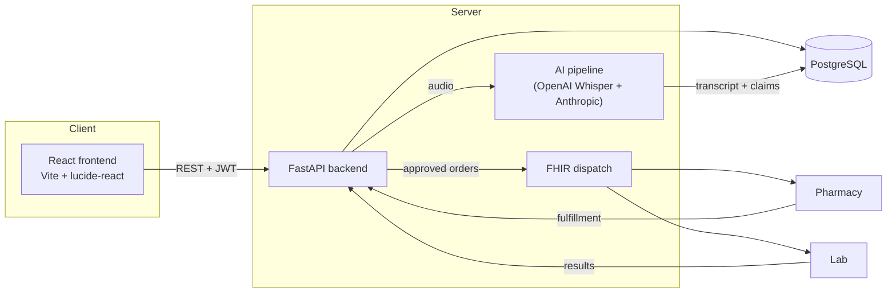
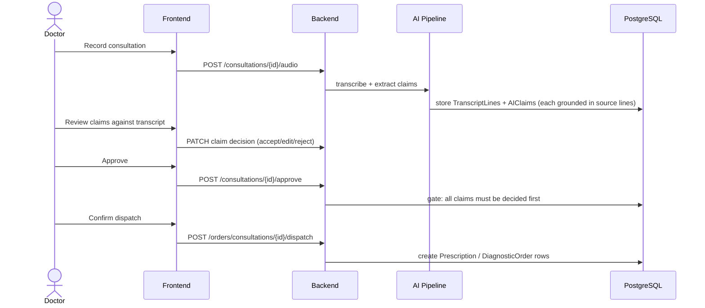

# Consult — AI-Assisted Clinical Consultation & Healthcare Workflow Platform

A full-stack system that turns a doctor-patient consultation into a structured,
auditable digital workflow: record the consultation, transcribe it, extract
clinical claims with an LLM (each one grounded in the exact transcript lines
that support it), have the doctor review and approve them, then dispatch the
resulting prescriptions and lab orders to pharmacies and labs.

Built from a Project Initiation Document through two full stacks (React +
FastAPI/PostgreSQL) to an integrated, dockerized, CI-tested application.

## Quickstart

```bash
git clone <this-repo>
cd consult
docker compose up --build
```

Then, once the containers are healthy:

```bash
docker compose exec backend python -m app.seed
```

- Frontend: http://localhost:5173
- Backend API docs: http://localhost:8000/docs
- Seeded login: `r.sharma@consult.dev` / `devpassword123`

(`make up` / `make seed` do the same two steps, if you have `make`.)

## Getting the real AI working (record audio → real transcription → real prescription suggestion)

This is the part that makes the project real rather than a UI demo over
seeded data: speaking into your mic, having it actually transcribed, and
having an LLM actually propose a prescription for you to review. It needs
two API keys — both are a two-minute signup, no cloud console, no billing
setup, no service-account JSON:

1. **Anthropic API key** (does the clinical reasoning — reads the
   transcript, proposes diagnosis/investigation/prescription, each claim
   citing exactly which line it came from):
   → https://console.anthropic.com/settings/keys
2. **OpenAI API key** (does the transcription, via the Whisper API):
   → https://platform.openai.com/api-keys

Then:

```bash
cd backend
cp .env.example .env
# open .env, paste your keys into ANTHROPIC_API_KEY= and OPENAI_API_KEY=
cd ..

ANTHROPIC_API_KEY=sk-ant-... OPENAI_API_KEY=sk-... docker compose up --build
docker compose exec backend python -m app.seed
```

Now, in the browser at http://localhost:5173:

1. Log in (`r.sharma@consult.dev` / `devpassword123`)
2. Go to a patient → **Start new consultation**
3. **Start recording**, say something like *"Patient reports a sore throat
   and fever since yesterday, mild difficulty swallowing, no cough"* → **Finish**
4. Watch it actually upload, actually transcribe via Whisper, and actually
   call Claude to propose structured claims — this is a real ~5–15 second
   round trip to two real APIs, not a canned delay
5. You land back in the review screen with **real AI-generated claims**,
   each one traceable to the exact line of your own transcript that
   produced it
6. Accept/edit/reject → **Approve and dispatch** → pick a pharmacy/lab →
   **Confirm and dispatch**

That loop — mic → real transcription → real LLM-proposed
prescription/investigation → doctor review → dispatch — is the actual
deliverable. Everything before this section in the README (Docker, CI,
tests) is what makes that loop trustworthy and repeatable, not a
replacement for it.

Without the keys set, every step up through claim review/approval/dispatch
still works against the seeded consultation; only the **live recording
path** needs them — and if a key is missing or wrong, it fails with a
specific, readable error (e.g. `OPENAI_API_KEY is not configured`) rather
than hanging or crashing.

## Architecture



## Core workflow



## Tech stack

| Layer | Choice |
|---|---|
| Frontend | React 18, Vite, `lucide-react` icons, hand-rolled hash router (no `react-router` dependency) |
| Backend | FastAPI, SQLAlchemy 2.0, PostgreSQL, Alembic, JWT auth |
| AI | OpenAI Whisper (transcription), Anthropic API with tool-use for grounded claim extraction |
| Infra | Docker + docker-compose, GitHub Actions CI |

## What's implemented vs. still a stub

This is stated plainly rather than glossed over, because a project that's
honest about its gaps is more credible than one that pretends to be finished:

**Real and verified:**
- Full frontend (8 screens) wired to a real backend — verified end-to-end
  against a live PostgreSQL database with actual HTTP requests (login, claim
  review, approval gating, role-based access control, facility order queue).
- A real production Vite build (not just a syntax check) — 1500+ modules
  compiled cleanly, plus a runtime smoke test that mounts the actual built
  bundle in a DOM environment and confirms it renders real content.
- The AI pipeline's *parsing and orchestration logic* — 16 passing unit
  tests against mocked Whisper / Anthropic API responses, covering the
  main safety property (claims citing no valid transcript line are dropped,
  never silently persisted ungrounded).
- The full claim → approve → dispatch state machine, including its
  server-side gates (can't approve with undecided claims, can't dispatch
  before approval, role-based 403s).
- Real microphone capture in the browser (`MediaRecorder`), uploading a
  real audio blob to the backend.

**Real code, not live-tested from inside the sandbox this was built in
(no external network access to OpenAI/Anthropic, no Docker daemon here) —
but fully runnable on a normal machine with real API keys, see
["Getting the real AI working"](#getting-the-real-ai-working-record-audio--real-transcription--real-prescription-suggestion) above:**
- Actual calls to OpenAI's Whisper API and the Anthropic API — the code is
  real (not stubs), tested here against mocked responses only. This is a
  sandbox constraint, not a code limitation — it will make real network
  calls the moment it runs anywhere with normal internet access and real
  keys.
- Docker images — Dockerfiles are written correctly but this environment
  has no Docker daemon to build/run them; `docker compose up` is untested
  here (though every step it automates — `pip install`, `npm run build`,
  Postgres seeding, the live API server — has been verified individually,
  including a real end-to-end failure-path test: uploading audio with no
  API key configured correctly returns a clean error instead of hanging).

**Honest stubs, flagged in code comments:**
- FHIR resource dispatch (logs instead of sending — see `fhir_dispatch.py`)
- Object storage (writes to local disk, not S3/GCS — see `storage.py`)
- No MFA, rate limiting, or audit logging (all implied by the original PID's
  privacy section, out of scope for this pass)

See [`backend/README.md`](backend/README.md) and
[`frontend/README.md`](frontend/README.md) for the full detail on each side.

## Testing

```bash
make test    # backend: pytest, 14/14 passing
make build   # frontend: real Vite build + jsdom runtime smoke test
```

Both run in CI on every push (see `.github/workflows/ci.yml`).

## License

MIT — see [LICENSE](LICENSE).
