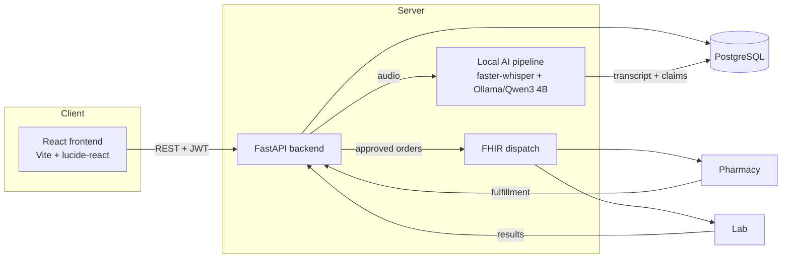
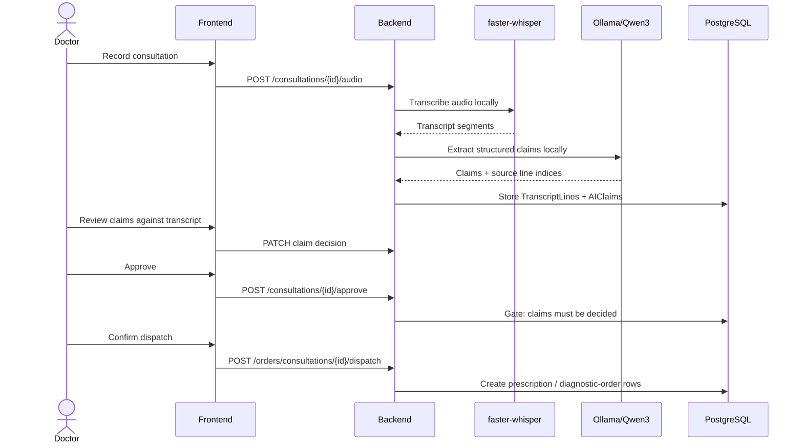

# Consult — AI-Assisted Clinical Consultation & Healthcare Workflow Platform

A full-stack prototype that turns a doctor-patient consultation into a structured,
auditable digital workflow: record the consultation, transcribe it, extract
structured clinical claims grounded in transcript lines, have the doctor review
and approve them, then move approved prescriptions and lab orders through the
workflow.

The project currently runs its AI pipeline **locally** on the user's computer,
so the live demo does not require OpenAI, Anthropic, or any other paid API.

Built from a Project Initiation Document through a React + FastAPI/PostgreSQL
stack with Docker support and GitHub Actions CI.

---

## Current AI setup — fully local and free

The current working configuration is:

- **Speech-to-text:** `faster-whisper` using the `base` Whisper model
- **LLM / claim extraction:** `Qwen3 4B` running locally through **Ollama**
- **Database:** PostgreSQL
- **No AI API keys required for the current local path**
- **No cloud AI billing required**

The live pipeline is:

```text
Doctor / Patient conversation
            ↓
      Browser recording
            ↓
       FastAPI upload
            ↓
   faster-whisper (local)
            ↓
       Transcript
            ↓
     Ollama + Qwen3 4B
            ↓
    Structured AI claims
            ↓
      Doctor review
       ↙          ↘
    Approve       Edit / Reject
       ↓
   Order preview / dispatch workflow
```

### Important limitation

The current local Qwen3 4B model is intentionally lightweight so that it can
run on a normal CPU-based machine. It is **not expected to have the same
reasoning quality as a larger frontier/cloud model**.

The current claim-extraction prompt is also deliberately grounded in the
transcript: the model should not invent diagnoses, tests, medicines, or other
facts that were not supported by the consultation. This makes the current
version primarily a **local clinical-documentation prototype**, rather than an
autonomous clinical decision-maker.

A stronger cloud LLM can be plugged in later as an optional provider if API
credentials are available.

---

## Quickstart

### Option 1 — Local development (the current tested workflow)

#### Backend

```bash
cd backend

# Windows
venv\Scripts\activate

pip install -r requirements.txt

alembic upgrade head

python -m app.seed

uvicorn app.main:app --reload
```

Backend API docs:

```text
http://localhost:8000/docs
```

#### Frontend

In a second terminal:

```bash
cd frontend
npm install
npm run dev
```

Frontend:

```text
http://localhost:5173
```

Seeded login:

```text
Email:    r.sharma@consult.dev
Password: devpassword123
```

### Local AI prerequisites

Install Ollama for Windows, then download the local model:

```powershell
ollama pull qwen3:4b-instruct
```

Ollama runs the model locally. No Ollama account is required for the local
workflow.

The Python backend uses the `ollama` package to communicate with the local
Ollama service.

The first use of `faster-whisper` also downloads the Whisper model. Subsequent
runs reuse the downloaded model.

---

## Optional cloud AI providers

The repository's `backend/.env.example` still contains:

```text
OPENAI_API_KEY=
ANTHROPIC_API_KEY=
```

These variables are present because the original project was designed with
OpenAI Whisper and Anthropic claim extraction as interchangeable external AI
providers.

**They are not required by the current local configuration.**

The current implementation uses:

```text
faster-whisper → local speech-to-text
Ollama/Qwen3 4B → local LLM
```

If someone later wants to upgrade the AI quality and has their own provider
credentials, the original architecture can be adapted to use:

```text
OpenAI API → cloud transcription
Anthropic API → cloud LLM / structured claim extraction
```

Those services require their own API access and may incur provider charges.
The current project deliberately does not depend on them.

### Environment file

For local development:

```bash
cd backend
copy .env.example .env
```

On Linux/macOS:

```bash
cp .env.example .env
```

Keep real API keys and secrets only in `.env`.

**Never commit `.env` to GitHub.**

The committed `.env.example` is only a template showing which configuration
variables the application can use.

---

## Using the application

1. Log in with the seeded doctor account.
2. Open a patient.
3. Select **Start new consultation**.
4. Start recording.
5. Speak a short consultation.
6. Finish the recording.
7. The audio is uploaded to the backend.
8. `faster-whisper` transcribes the audio locally.
9. Ollama sends the transcript to the local Qwen3 model.
10. Structured claims are displayed in the doctor review screen.
11. Review each claim against its transcript source.
12. Accept, edit, or reject claims.
13. Approve the consultation once all required decisions are complete.
14. Continue to the order preview / dispatch workflow.

The application uses transcript-source references so that generated claims can
be checked against the original consultation text.

---

## Architecture



---

## Core workflow



---

## Tech stack

| Layer | Choice |
|---|---|
| Frontend | React 18, Vite, `lucide-react`, hand-rolled hash router |
| Backend | FastAPI, SQLAlchemy 2.0, PostgreSQL, Alembic, JWT auth |
| Speech-to-text | `faster-whisper` — local `base` model |
| Local LLM | Ollama + Qwen3 4B |
| AI API dependency | None for the current local workflow |
| Infrastructure | Docker + docker-compose, GitHub Actions CI |
| Storage | Local filesystem in the current prototype |

---

## What's implemented vs. still a stub

This section is intentionally explicit about the project's current scope.

### Implemented and tested

- Full React frontend wired to the FastAPI backend.
- PostgreSQL persistence and database migrations.
- Seeded authentication and role-based access.
- Real browser microphone capture using `MediaRecorder`.
- Real audio upload to the backend.
- Local Whisper transcription using `faster-whisper`.
- Local LLM processing using Ollama/Qwen3 4B.
- Structured claim extraction with transcript-line grounding.
- Claim review with accept/edit/reject actions.
- Server-side approval gates.
- Order preview / dispatch workflow.
- Frontend production build and runtime smoke testing.
- Backend unit tests for AI parsing/orchestration and core workflow behavior.
- GitHub Actions CI configuration.

### Current local-AI limitations

- Qwen3 4B is a lightweight local model and is less capable than larger
  frontier models for complex reasoning.
- CPU inference is slower than a cloud AI API or a machine with suitable GPU
  acceleration.
- The current system is not a validated medical decision-support system.
- The AI should be treated as a draft/suggestion layer requiring clinician
  review, not as an autonomous prescriber.
- Speaker diarization is not implemented; Whisper transcript lines are labeled
  `dictation`.
- PII redaction is pattern-based and is not a complete clinical-grade
  de-identification system.

### Honest stubs / prototype components

- FHIR dispatch currently logs rather than sending to a real FHIR endpoint.
- Object storage currently writes to local disk rather than S3/GCS.
- Production-grade MFA, rate limiting, audit logging, and other security
  controls are not implemented in this prototype.

---

## Optional future AI upgrade

If API credentials become available, the local AI layer can be replaced or
augmented with stronger hosted models.

A possible future configuration is:

```text
Current:
Browser → faster-whisper → Ollama/Qwen3 4B → Doctor review

Optional higher-capability configuration:
Browser → OpenAI Whisper API → Anthropic / other LLM → Doctor review
```

This is an **optional upgrade**, not a requirement for running the project.

Potential improvements include:

- Higher-capability clinical reasoning models.
- Better speaker diarization.
- Larger local models when suitable hardware is available.
- More robust PII/PHI detection.
- Clinical validation and safety evaluation.
- Production authentication and audit logging.
- Real FHIR/EHR integration.
- Better model evaluation with a curated test set.

---

## Testing

```bash
make test
make build
```

The backend tests cover the AI parsing/orchestration logic and important
workflow gates. The frontend command performs a real Vite build and runtime
smoke test.

GitHub Actions runs the configured CI checks on pushes.

---

## Project status

**Current status: Local AI prototype / college-project implementation**

The complete consultation workflow is functional with locally running AI.
The project is intentionally designed so that the AI provider can be replaced
later without redesigning the rest of the application.

---

## License

MIT — see [LICENSE](LICENSE).
